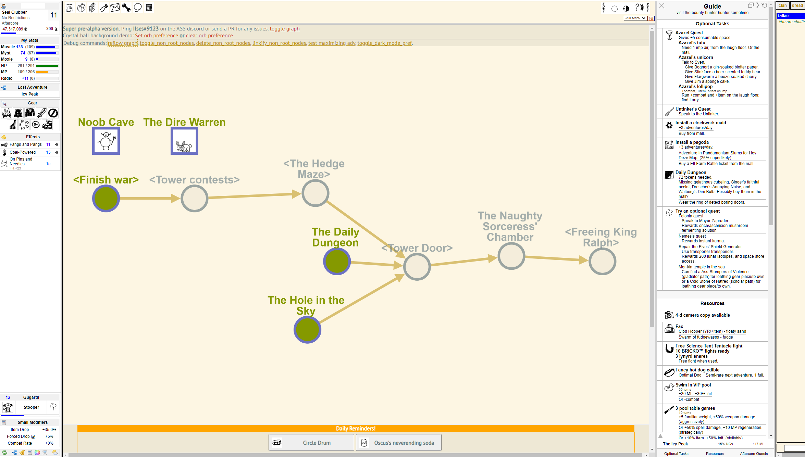

# Graph Navigation UI / Ilses (gnui)
A new interface for your KoL quests!

## Installation
For now, copy `*.html *.ash, *.js` files into your `relay/` directory.

(I'll rearrange for `svn checkout` installation when this repo is more mature.)

### Dependencies
- We might depend on tourguide behavior? Hopefully not?

- For now, a modified version of clilinks is included as a hacky JS --> Mafia real-time interface.

## Usage

- Scroll to zoom, tap + drag to pan.

- Nodes can be dragged around (but nothing is persistent, yet).

- Double-click a root node (green text) to navigate to the corresponding location.

- Fake nodes are denoted with angle bracket names, e.g.: <name>. These do not currently have hyperlinks.

- Mafia preferences are scraped to determine which nodes are no longer useful.
  - However, the current implementation is incomplete and likely to be buggy.

## Known issues
  - Main quest support is only mostly-complete. There will be bugs. Currently, this is a mostly-functional demo.
  - We're not saving node state. Thus, changes to node positions will not be saved.
  - Yes, the color-coding needs to change / exist. Let me know if you have suggestions.
    - A Solarized dark mode would probably be nice
  
## Wishlist
  - Nodes can have images, e.g. zone image, orb predicted monster, etc.
  - Node/edge coloring can be based on delay, need for item/+ML/..., etc.
  - Single-click could show zone information, encounter queue, delay, etc.
  - The layout algorithm could use some improvements.
